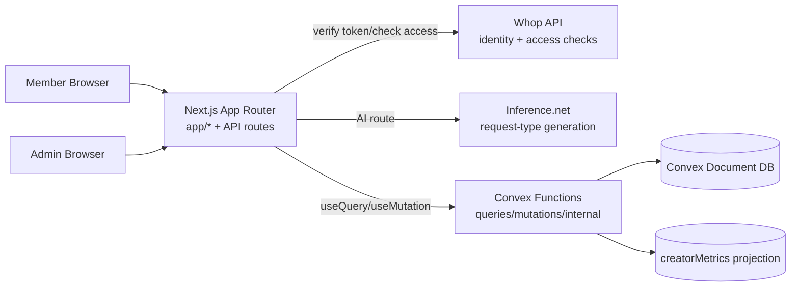

# Architecture Overview

Creator Inbox is a route-driven Next.js application backed by Convex domain functions. The UI layer handles user interactions and view composition, while Convex is responsible for submission/request type state transitions and KPI projection state.

## System Context

## Primary Runtime Paths

1. **Member path**
   - Route: `app/experiences/[experienceId]/page.tsx`
   - Loads access data from `/api/whop/user`
   - Reads request types and visible submissions via Convex queries
   - Creates submissions via Convex mutation

2. **Admin path**
   - Route: `app/experiences/[experienceId]/admin/page.tsx`
   - Requires Whop admin access
   - Manages request types and answers submissions
   - Reads KPI cards from projection-backed admin metrics query

3. **AI generation path**
   - Route: `app/api/inference/request-types/route.ts`
   - Validates request payload with zod
   - Verifies Whop token and admin access
   - Calls `lib/inference/generate-request-types.ts`

## Data Ownership

- `requestTypes` holds creator-defined paid offer templates.
- `submissions` holds transactional request/response records.
- `creatorMetrics` holds denormalized KPI counters and monetary totals used by admin cards.

`creatorMetrics` is updated in mutation write paths and can be rebuilt with `backfillCreatorMetrics`.
